# Manna Maker Cognitive OS: Enterprise-Grade Autonomous Intelligence Backend

[](https://opensource.org/licenses/MIT) [](https://www.python.org/) [](https://github.com/PastSmartLink/pro-main)

**A PhD-Level Cognitive Operating System Backend, Engineered for Google Cloud ADK**

The Manna Maker Cognitive OS™️ is a pioneering multi-agent AI architecture designed to deliver strategic intelligence across domains. This `pro-main` repository hosts the backend engine powering [SPORTSΩmegaPRO](https://www.sportsomega.com), transforming chaotic data into predictive, narrative-driven **Ωmega Scouting Dossiers**. Optimized for Google Cloud ADK, it leverages a 20-stage Cognitive-Symbolic Meta-Programming (CSMP) pipeline as its core innovation, redefining autonomous intelligence for enterprise-grade applications.

---

## 📖 Table of Contents

- [Live Ecosystem: PRO Tier Backend](#-live-ecosystem-pro-tier-backend)
- [Core Innovation: Manna Maker OS Backend](#-core-innovation-manna-maker-os-backend)
- [20-Stage CSMP Pipeline](#-20-stage-csmp-pipeline)
- [Tech Stack & ADK Architecture](#%EF%B8%8F-tech-stack--adk-architecture)
- [Setup and Installation](#%EF%B8%8F-setup-and-installation)
- [Competitive Positioning](#-competitive-positioning)
- [What’s Next: The Universal Cognitive OS](#-whats-next-the-universal-cognitive-os--a-declaration-of-intent)
- [Contact](#-contact)

---

## 🚀 Live Ecosystem: PRO Tier Backend

This `pro-main` repository powers the PRO Tier backend of [SPORTSΩmegaPRO](https://www.sportsomega.com), accessible via the "Unlock Ωmega PRO Scouting Dossier" button (Beta, free for now). The backend, orchestrated by Google Cloud ADK and powered by Google Gemini, generates premium dossiers with deep tactical insights. Experience the end-to-end logic in action at the PRO Blueprint Demo: [https://pro-9wil.onrender.com](https://pro-9wil.onrender.com).

**Live Demo**: 🌐 [https://pro-9wil.onrender.com](https://pro-9wil.onrender.com)

---

## 💡 Core Innovation: Manna Maker OS Backend

The Manna Maker Cognitive OS™️ backend is a **Version 3.5 Modular Cognitive Workflow**, redefining AI as a strategic operating system. Inspired by quantum attunement and chaotic navigation, it processes complex data through a 20-stage CSMP pipeline, making it adaptable to any domain.

- 🧠 **Modular CSMP Framework**: The 20-stage pipeline orchestrates specialized agents (e.g., `chief_scout.py`) and tools (e.g., `perplexity_research.py`), optimizing token usage and enabling iterative refinement.
- 🤔 **SUPERGROK Curiosity Engine**: The Gemini-powered `chief_scout` agent generates non-obvious, high-value queries, exploring vast possibility spaces to uncover hidden leverage points.
- 🔄 **Cognitive Loop**: Iterative research via Perplexity AI and state management (e.g., `dossier_generator.py`) ensures robust, actionable outputs.
- 👤 **Human-in-Command**: Guided by a Master Cognitive Directive, the backend amplifies human strategic vision, serving as a force-multiplier.

---

## 🏗️ 20-Stage CSMP Pipeline

The backend’s 20-stage CSMP pipeline is the heart of the Manna Maker Cognitive OS™️, ensuring rigorous analysis, validation, and insight generation. The following diagram illustrates the cognitive workflow:

```mermaid
graph TD
    subgraph Phase 0: Setup & Initiation
        A[User App Request POST /v1/generate-dossier] --> B[ADK Orchestrator];
        C[Master_Cognitive_Directive.md] --> D{Manna Maker Cognitive OS Core};
        B --> D;
        style C stroke:#f96,stroke-width:2px,stroke-dasharray: 5 5;
    end

    subgraph Phase 1: Initial Synthesis & Inquiry [Stages 2-6]
        D --> S2[Stage 2: Initial Analysis];
        S2 --> S3[Stage 3: News Synthesis];
        S3 --> S4[Stage 4: SUPERGROK Inquiry];
        S4 --> S5[Stage 5: Parallel Perplexity Research];
        S5 --> S6[Stage 6: Findings Integration];
    end

    subgraph Phase 2: Narrative & Adversarial Analysis [Stages 7-8.6]
        S6 --> S7[Stage 7: Core Narrative Generation];
        S7 --> S8[Stage 8: Hidden Gems Extraction];
        S8 --> S8_5[Stage 8.5: Alternative Perspectives];
        S8_5 --> S8_6[Stage 8.6: Red Team Counter-Narrative];
        style S8_6 stroke:#c00,stroke-width:3px;
    end

    subgraph Phase 3: Dossier Assembly & Meta-Prompt [Stages 9-10.5]
        S8_6 --> S9[Stage 9: Structured Dossier Assembly];
        S9 --> S9_5[Stage 9.5: Synthesize Super Prompt];
        S9_5 --> S10[Stage 10: Narrative Refinement];
        S10 --> S10_5[Stage 10.5: Predictive Outcome];
    end

    subgraph Phase 4: COGSEC - Cognitive Security & Deep Validation [Stages 11-20]
        style COGSEC fill:#fff5f5,stroke:#c00,stroke-width:2px
        S10_5 --> S11[Stage 11: Self-Optimizing Prompt Engine];
        S11 --> S12[Stage 12: First Principles Validation];
        S12 --> S13[Stage 13: Cross-Domain Mapping];
        S13 --> S14[Stage 14: Visualization Hypothesis];
        S14 --> S15[Stage 15: Sentiment Calibration];
        S15 --> S16[Stage 16: Predictive Scenario Modeling];
        S16 --> S17[Stage 17: Ethical Review Protocol];
        S17 --> S18[Stage 18: User Engagement Optimization];
        S18 --> S19[Stage 19: Metadata Enrichment];
        S19 --> S20{Stage 20: Final Validation Gate};
    end

    subgraph Phase 5: Final Output
        S20 -->|GO: Output Passes| FinalOutput[✅ Validated Dossier Delivered to User];
        S20 -->|NO GO: Flaw Detected| FailureReport[❌ Failure Report & Re-execution Loop];
    end

    classDef default fill:#fff,stroke:#333,stroke-width:2px;
    classDef cogsecPhase fill:#ffefff,stroke:#909,stroke-width:2px;
```



### Key Architectural Stages
- **Stage 8.6: Red Team Counter-Narrative**: Adversarial testing to challenge the primary analysis, ensuring robustness.
- **Stage 12: First Principles Validation**: Rebuilds arguments from axiomatic truths, discarding unproven assumptions.
- **Stage 13: Cross-Domain Mapping**: Applies analogies from unrelated fields (e.g., biology, finance) for novel insights.
- **Stage 16: Predictive Scenario Modeling**: Maps multiple potential futures beyond single-point forecasts.
- **Stage 17: Ethical Review Protocol**: Audits for biases and second-order consequences, ensuring responsible outputs.
- **Stage 20: Final Validation Gate**: Ensures coherence, evidence, and actionability before output release.

---

## 🛠️ Tech Stack & ADK Architecture

- **Core**: Manna Maker Cognitive OS™️ (Proprietary Multi-Agent Framework)
- **Framework**: Google Cloud Agent Development Kit (ADK)
- **AI Models**: Google Gemini (Chief Scout), Perplexity AI (Research Tool)
- **Backend**: Python 3.11+, FastAPI, Uvicorn
- **Deployment**: Render.com (Blueprint), Docker
- **Libraries**: `aiohttp`, `python-dotenv`, `tenacity`, `cachetools`

The backend integrates seamlessly with Google Cloud ADK through decorators (`@adk.tool`, `@adk.agent`) and a FastAPI endpoint (`/api/dossier/generate`), orchestrating agents (e.g., `chief_scout.py`) and tools (e.g., `perplexity_research.py`, `baseline_data.py`) to execute the 20-stage CSMP pipeline.

---

## ⚙️ Setup and Installation

*Note: This repository is intended for demonstration and enterprise deployment. Setup instructions are provided for authorized developers or Google Cloud ADK teams only. Public cloning or local execution is not supported.*

### 1. Prerequisites
- Python 3.11+, Git

### 2. Clone Repository
```bash
git clone https://github.com/PastSmartLink/pro-main.git
cd pro-main
```

### 3. Setup Environment
```bash
python -m venv venv
source venv/bin/activate  # Windows: .\venv\Scripts\activate
pip install -r requirements.txt
```

### 4. 🚨 Configure Environment (IP Protection)
Copy `.env.example` to `.env`. Add secret keys (`PERPLEXITY_API_KEY`, `GEMINI_API_KEY`, etc.) and populate `CSMP_..._PROMPT` variables with prompt texts from the secure `prompts/` directory (available to authorized personnel only).

### 5. Run Service
```bash
# macOS/Linux:
export PYTHONPATH=$(pwd)
# Windows:
set PYTHONPATH=%CD%

uvicorn api.adk_service_api:app --host 0.0.0.0 --port 8001 --reload
```

API available at `http://127.0.0.1:8001` for authorized testing.

---

## 🏆 Competitive Positioning

Manna Maker Cognitive OS stands alongside industry leaders by offering a specialized, enterprise-grade alternative to general-purpose AI models.

| Feature                    | Manna Maker OS             | OpenAI (GPT-4)          | Anthropic (Claude)      | Google (Gemini)         |
|----------------------------|----------------------------|-------------------------|-------------------------|-------------------------|
| **Cognitive Architecture** | ✅ 20-Stage Pipeline       | ❌ Single-stage          | ❌ Single-stage          | ❌ Single-stage          |
| **Adversarial Testing**    | ✅ Built-in (Stage 8.6)    | ⚠️ External Tooling     | ⚠️ External Tooling     | ⚠️ External Tooling     |
| **Ethical Framework**      | ✅ Integrated (Stage 17)   | ⚠️ External Moderation  | ✅ Constitutional        | ⚠️ External Moderation  |
| **Reasoning Transparency** | ✅ Fully Auditable Stages  | ❌ Opaque               | ❌ Opaque               | ❌ Opaque               |
| **Innovative Insight**     | ✅ Cross-Domain Mapping    | ❌ Domain-limited       | ❌ Domain-limited       | ❌ Domain-limited       |
| **Self-Optimization**      | ✅ Prompt Engine Tuning    | ❌ Static               | ❌ Static               | ❌ Static               |

### Unique Differentiators
1. **Philosophical Foundation**: A "Human-in-Command" paradigm ensures AI amplifies human strategy.
2. **Chaos Theory Integration**: Advanced non-linear analysis for complex, dynamic systems.
3. **Red Team Validation**: Built-in adversarial testing for robust outputs.
4. **Cross-Domain Mapping**: Analogical reasoning across disciplines for innovative solutions.

---

## 🌌 What’s Next: The Universal Cognitive OS – A Declaration of Intent

The Manna Maker Cognitive OS™️ transcends its initial sports analytics application. Sports served as a data-rich, high-stakes laboratory to validate the backend’s capabilities. This repository marks Milestone 1 in our vision to create a **Universal Cognitive OS** capable of mastering any domain.

### The "007" Use Case: From Sports to Geopolitics
Imagine analyzing the global semiconductor market to produce a "Geopolitical Risk & Supply Chain Volatility Dossier":
- **Initial Synthesis**: Ingests TSMC production reports, shipping lane data, Chinese state media, and commodity prices.
- **SUPERGROK™️ Inquiry**: Asks unasked questions, e.g., “What’s the hidden correlation between South China Sea naval drills and Dutch lithography suppliers’ stock prices?”
- **Targeted Execution**: Dispatches tools to analyze shipping manifests, political appointments, and obscure maintenance schedules, delivering predictive intelligence for hedge funds, governments, and corporations.

### The End-Game: A Domain-Agnostic Platform
The `pro-main` backend is not just a sports analysis engine—it’s the cornerstone of a new AI category. Retargeted with new data sources and domain configurations, it can tackle geopolitical risk, financial markets, or enterprise intelligence. Winning the Google Cloud ADK Hackathon validates this vision, paving the way for broader enterprise adoption.

---

## 📄 License

MIT License. See [LICENSE](LICENSE).

---

## 📬 Contact

**Architect**: Hans Johannes Schulte  
**Email**: [pastsmartlink@gmail.com](mailto:pastsmartlink@gmail.com)  
**Devpost**: [devpost.com/pastsmartlink](https://devpost.com/pastsmartlink)  
**GitHub**: [github.com/PastSmartLink/pro-main](https://github.com/PastSmartLink/pro-main)  
**Hackathon**: [Google Cloud ADK Hackathon](https://devpost.com/software/sportsomegapro)